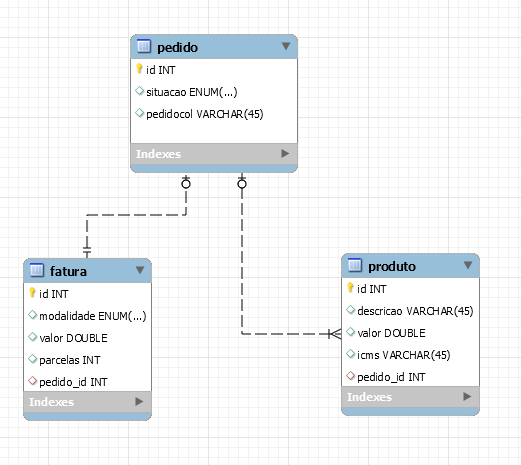

# Clean Arch. Dojo

### Objetivos gerais
Este dojo tem como objetivo desenvolver entendimento e um design solido de um projeto baseado no estudo do livro [Clean Architecture](https://www.amazon.com.br/Clean-Architecture-Craftsmans-Software-Structure-ebook/dp/B075LRM681/ref=asc_df_B075LRM681/?tag=googleshopp00-20&linkCode=df0&hvadid=379725685153&hvpos=&hvnetw=g&hvrand=14218642289539629535&hvpone=&hvptwo=&hvqmt=&hvdev=c&hvdvcmdl=&hvlocint=&hvlocphy=20088&hvtargid=pla-406131052745&psc=1) e [SOLID](https://www.amazon.com.br/Clean-Code-Handbook-Software-Craftsmanship-ebook/dp/B001GSTOAM/ref=pd_sim_351_1/140-5095746-4976859?_encoding=UTF8&pd_rd_i=B001GSTOAM&pd_rd_r=4c433c94-00fb-404e-8493-a36ad5fea146&pd_rd_w=l5fQN&pd_rd_wg=t4uJk&pf_rd_p=1dd738b7-cb33-4745-82d8-d54bbfb14c91&pf_rd_r=0XVFWVD64PQE87NSKTGQ&psc=1&refRID=0XVFWVD64PQE87NSKTGQ).
### Modelo de dados

### Estudo de caso
Sua equipe trabalha e uma parte muito maior de um projeto financeiro com focos em produtos e viagens, seu squad recebeu como tarefa implementar um meio de pagamento online usando cartão de credito, deve-se garantir todos o workflow da transação. Assumindo que exista um produto e esta loja seja em São Paulo, seu time deve atender os seguintes requisitos:
#### Casos
> - Permitir que selecionar produtos e sua quantidade
> - Permitir que informar um estado para tributação
> - Permitir que informar o numero de cartão
> 	- Meio de pagamento(Credito ou Debito)
> 	- Quantidade de Parcelas
> - Transmitir dados da cobrança para API externa para efetuar a cobrança
> - Exibir mensagens de cobranças de sucesso

#### Requisitos funcionais
> - Quando for informado os estados DF e GO deve-se cobrar R$ 40,00 de frete, quando informar PA deve-se cobrar R$ 55,00 de frete, quando for enviado para SP não deve se cobrar frete e para os demais cobrar R$ 20,00 frete.
> - Quando for informado o estado de RJ, MG, DF devem ser cobrados 2.89% de tributos sobre o valor total da compra e 3.75% para os demais.
>  - Quando for informado compra a credito e enviar para estados MG, DF e GO, deve-se dividir ICMS do produto em 2 e somar ao valor total da compra, para os demais deve-se somar o ICMS ao valor da compra.
>  - Quanto a compra for debito e o valor da compra for superior a R$ 1000,00 deve-se dar 5% de desconto sobre o valor da compra sem impostos, taxas e frete, quando o valor da compra for múltiplo de 1000 até o máximo de 10000 deve-se acrescentar 1.67% de desconto a cada múltiplo de 1000 somados aos 5% já concedidos.
> 		- Acima de R$ 1000,00, desconto de 5% = R$ 950,00
> 		- Múltiplo de 1000 é 2000, desconto de 5% + 1,67% = R$ 1866,6
> 		- Múltiplo de 2000 é 4000, desconto de 5% + 1,67% de 2000 + 1,67% de 4000 = R$ 3666,4.
> - Não deve permitir concluir compra se cartão não possuir saldo.

#### Requisitos não funcionais
> - Usar TDD
> - SOLID
> - Clean Architecture
> - Escrever um código em toda a equipe concorde, independente da qualidade.
> - Código não pode ter dependências com bibliotecas externas, excepcionalmente Lombok*.
> - Obrigatoriamente se divirtam ou parem.
> - Escolham o modelo Dojo que mais gostam.

#### Referencias de estrutura de Clean Architecture

